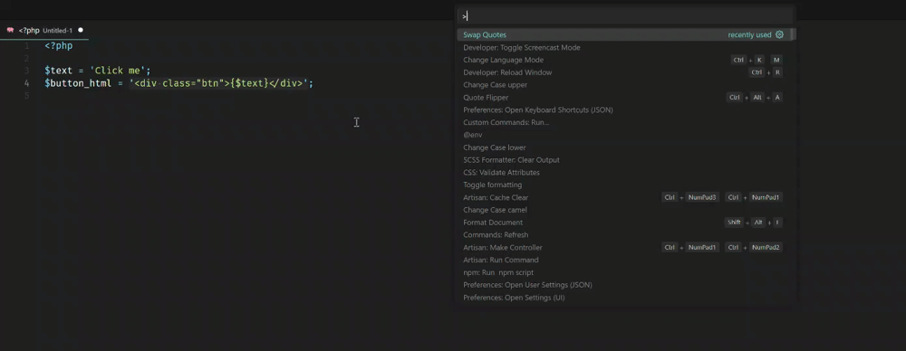

# Quote Swapper
This is a very simple extension that does one thing. It will swap single quotes to double quotes and vice versa.

## Usage



### Explanation

Let's say you have the following code.

```php
$text = 'Click me';
$button_html = '<div class="btn">{$text}</div>';
```

And you want php to parse the variable `$text` inside the double quotes. You can do it by swapping the quotes.

Run the command "Swap Quotes" from the command palette and you will get:

```php
$text = 'Click me';
$button_html = "<div class='btn'>{$text}</div>";
```

**Enjoy!**
